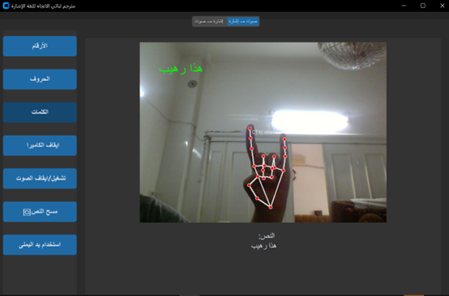

# 🖐 Arabic Sign Language Bidirectional Translator

A **bidirectional translator for Arabic Sign Language**, converting **speech → sign** and **sign → speech** in real-time using your webcam.  
This project supports **letters, numbers, and words/phrases** recognition with live Arabic text output.

---

## ✨ Features

### 1️⃣ Speech → Sign
- Type a word or sentence manually or **use your voice** 🎤.  
- Displays **animated GIFs** for words in Arabic.  
- Supported words include: `"mom"`, `"Alhamdulillah"`, `"angry"`, `"house"`, `"how are you"`, and more.  
- GIFs are fetched **directly from online URLs** 🌐.  

### 2️⃣ Sign → Speech
- Real-time hand sign recognition via **webcam** 🎥.  
- Supports three model types:
  - **Numbers** (0–10)
  - **Arabic letters**
  - **Words/Phrases**
- Uses **MediaPipe Hands** for hand tracking 🖐.  
- Recognizes repeated signs and **speaks them aloud in Arabic** 🔊.  
- Displays **shaped Arabic text** on screen using `arabic_reshaper` + `python-bidi`.  

### 3️⃣ Data & Models
- Collected **~500 images per class** for letters, numbers, and words.  
- Landmarks extracted and saved in **pickle files** for training.  
- Trained **Random Forest classifiers** for each category.  
- Real-time predictions use these pre-trained models.  

### 4️⃣ Controls
- Start/stop the camera 🎥  
- Enable/disable speech 🔊  
- Toggle between right/left hand ✋  
- Clear recognized text 🧹  

---

## 🛠 Dependencies

Python 3.8+ and the following libraries:

```bash
pip install customtkinter pillow requests SpeechRecognition opencv-python mediapipe numpy arabic-reshaper python-bidi gTTS pygame scikit-learn
```
## 📸 Screenshots
---
### Voice → Sign


See how typed or spoken text is converted to animated sign GIFs instantly.

### Sign → Speech


Real-time hand sign recognition shows the corresponding Arabic text and speaks it aloud.
## 🚀 How to Use
---

### Text/Speech → Sign
1. Go to the **"Text → Sign"** tab.  
2. Type a word and click **Show GIF**, or click **Click to Record** to use speech input.  
3. The corresponding GIF will appear.

### Sign → Speech
1. Go to the **"Sign → Speech"** tab.  
2. Select **Numbers, Letters, or Words**.  
3. The **webcam** will detect your hand signs.  
4. Recognized signs are:  
   - **Spoken aloud in Arabic** 🔊  
   - **Displayed as shaped Arabic text** 🖋  
5. Use the **Clear Text** button 🧹 to reset.  
6. Toggle hand using **Use Left/Right Hand** button ✋  

---

## 💡 Notes
- Audio is cached in `audio_cache/` for faster playback 🎧  
- Left-hand recognition mirrors coordinates for accuracy ↔️  
- Minimum interval prevents repeated audio output ⏱  
- Internet is required to display GIFs 🌐  
- Maintain equal number of images per class (~500) for better accuracy  
- Models can be upgraded to **CNN/LSTM** for higher accuracy 🤖  

---

## 🔮 Future Improvements
- Expand dataset with more words and phrases 📚  
- Implement deep learning models for higher accuracy 🔥  
- Add a **GUI interface** for interactive feedback 🖥  
- Support multiple hands and gestures simultaneously ✌️  
